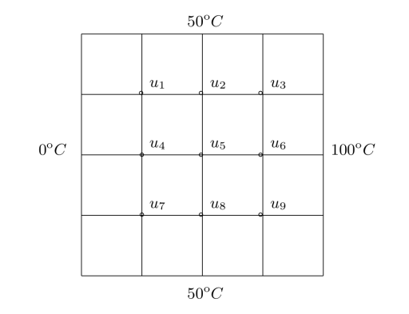

# Assessment of Programming Languages for Computational Numerical Dynamics

Establishing efficiency evaluations and comparisons of different programming languages is not a trivial task.

The comparisons proposed in the present work address routines usually applied in CFD algorithms, i.e. solving system of linear equations, and changing vector element positions. The tests are Copying Arrays, Matrix Multiplication, Fibonacci's Sequence and solve a Linear System.

These are important tests because, in major CFD and Heat Transfer problems, it is necessary to set up a mesh grid and manipulate large amount of data.

The computer parameters are listed below, all tests were done in isolation so that there was no interference from third parties in the speed:

    -Name from Operational System: Ubuntu 18.04.4 LTS\

    -Processor: Intel(R) Core(TM) i7-6500U CPU @ 2.50GHz x4

    -Installed RAM: 15,3 GB 

## Copying Arrays

Considering an A tri-dimensional matrix -- shape (n, n, 3), which is modified according to the following equation:

    A[i,j,1] = A[i,j,2]
    
    A[i,j,3] = A[i,j,2]

For that, the numerical operations have been made by using loops or vectorization procedure

## Matrix Multiplication

Test in order to solve a simple matrix multiplication. Assuming an A and B arbitrary matrix,

    R = A x B

where R is the result of this operation. It is important to mention that some programming languages have this process as an intrinsic routine. As well as in the first test, here I also used loops and vectorization

## Fibonacci's Sequence

Fibonacci's Sequence is the infinite sequence of numbers that is governed by the following formula:

    F_{n} = F_{n-1} + F_{n-2}, 
    
    where n is greater than 1 and belongs to the Integer Set

 
The main purpose here is to calculate the execution time of the program on finding the Fibonacci's number according to its $n$ indices. However for this third test, we used loops and recursive functions

## Linear System

As the last test, it is proposed the resolution of a linear system based on the following problem. It consists of a flat surface with 9 nodes, and the contour temperatures are known. It is easy to understand that each node temperature must be equal to the sum's average of the adjacent temperatures.

